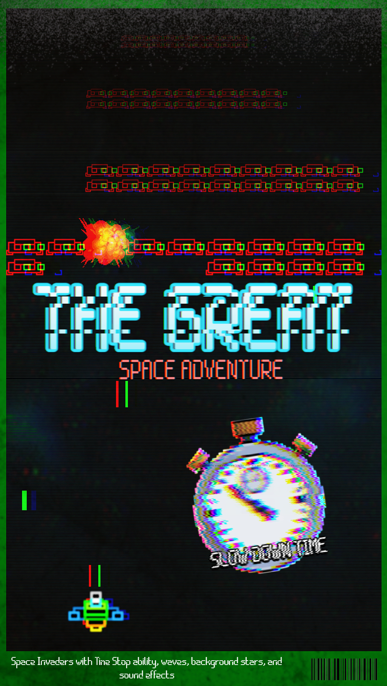
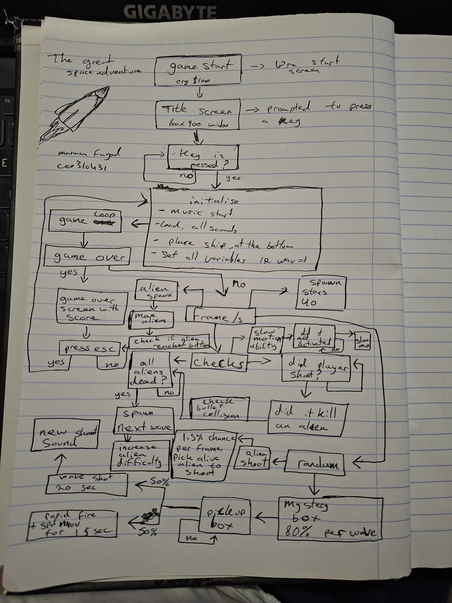

# The-great-space-adventure-68k-assem

## Trailer

[https://youtu.be/X13U2M3_ZVo](https://youtu.be/2ioF7Cn5g0g)

## gameplay

/workspaces/The-great-space-adventure-68k-assem/gameplay_video(1)(1).mp4

## Description
A Space Invaders recreation written in 68k assembly.

This project recreates classic arcade-style alien waves with a custom Time Stop ability, background stars, and sound effects for shooting, hits, and special moments. It is a small retro game project focused on low-level gameplay logic and fast arcade action.
try to beat the current top score of 1260.

## Controls Summary

| Key | Action |
|-----|--------|
| ← → | Move ship |
| Space | Shoot |
| ↑ | Time Stop |
| Esc | Restart |

## Features

- Multiple waves of aliens with increasing difficulty
- Power-ups:
  - **Heart Pickup** - Restores a life (max 5)
  - **Mystery Box** - Grants random ability:
    - *Wave Attack* - Wide piercing bullets (20 sec)
    - *Rapid Fire + Speed Boost* - Fast shooting and movement (15 sec)
- Negative events:
  - *Weapon Malfunction* - 1% chance on alien kill, slows and wobbles bullets (10 sec)
- Time Stop ability with cooldown
- Particle explosions
- Starfield background
- Sound effects and music

## flowchart

## current settings

SHIP_W      EQU         20          ; Ship Width
SHIP_H      EQU         10          ; Ship Height
SHIP_SPEED  EQU         01          ; Ship Movement Speed

BULLET_W    EQU         3           ; Bullet Width
BULLET_H    EQU         10          ; Bullet Height
BULLET_SPD  EQU         07          ; Bullet Speed (upward)
MAX_BULLETS EQU         8           ; Max player bullets on screen

ALIEN_W     EQU         40          ; Alien Width
ALIEN_H     EQU         10          ; Alien Height
ALIEN_COLS  EQU         09          ; Number of alien columns
ALIEN_ROWS  EQU         02          ; Number of alien rows
ALIEN_SPD   EQU         01          ; Alien base horizontal speed (slower)
ALIEN_GAP   EQU         40          ; Gap between aliens
ALIEN_MOVE_DELAY EQU    4           ; Only move aliens every N frames

SLOW_DURATION EQU       500         ; Slow motion lasts 5 seconds (in hundredths)
SLOW_COOLDOWN EQU       2000        ; 20 second cooldown (in hundredths)
SLOW_FACTOR EQU         10          ; Aliens move 10x slower during slow-mo

NUM_STARS   EQU         40          ; Number of stars in background

; Particle system constants
MAX_PARTICLES EQU       12          ; Max particles per explosion
PARTICLE_LIFE EQU       20          ; Particle lifetime in frames

; Heart pickup constants
HEART_SIZE    EQU       14          ; Heart pickup size
HEART_SPEED   EQU       2           ; Heart fall speed
MAX_LIVES     EQU       5           ; Maximum lives player can have

; Mystery Box configuration
MYSTERY_SIZE    EQU     20          ; Mystery box size
MYSTERY_SPEED   EQU     1          ; Mystery box fall speed
MYSTERY_SPAWN_CHANCE EQU 70         ; Chance to spawn (lower = more rare)

; Wave Attack ability configuration
WAVE_DURATION   EQU     1000        ; Wave attack lasts 10 seconds (in hundredths)
WAVE_WIDTH      EQU     50          ; Wave attack bullet width (adjustable)
WAVE_HEIGHT     EQU     3          ; Wave attack bullet height (adjustable)

; Rapid Fire + Speed ability configuration
RAPID_DURATION  EQU     600         ; Rapid fire lasts 6 seconds (in hundredths)
RAPID_SHIP_SPEED EQU    4           ; Ship speed during rapid fire (3x normal)
RAPID_COOLDOWN  EQU     15           ; Frames between rapid fire shots

; Weapon Malfunction (negative event) configuration
MALFUNC_CHANCE  EQU     1           ; 1% chance on alien kill
MALFUNC_DURATION EQU    500        ; Malfunction lasts 5 seconds (in hundredths)
MALFUNC_BLT_SPD EQU     2           ; Bullet speed during malfunction (half)

ALN_BLT_W   EQU         02          ; Alien bullet width
ALN_BLT_H   EQU         06          ; Alien bullet height
ALN_BLT_SPD EQU         01          ; Alien bullet speed (downward)
MAX_ALN_BLT EQU         20          ; Max alien bullets at once

SHOOT_INDEX EQU         00          ; Shoot Sound Index  
HIT_INDEX   EQU         01          ; Hit Sound Index  
OPPS_INDEX  EQU         02          ; Game Over Sound Index
MUSIC_INDEX EQU         03          ; Music Sound Index
TIMEFREEZE_INDEX EQU    04          ; Time Freeze Sound Index
WAVESHOOT_INDEX EQU     05          ; Wave Shoot Sound Index

BULLET_OFF  EQU         130         ; Bullet off-screen Y position

SCR_WIDTH   EQU         600         ; Screen width
SCR_HEIGHT  EQU         920         ; Screen height

## Screenshots

